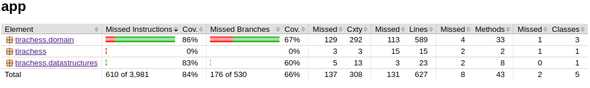

# Testing Document

The application has been testing using Unit tests.

## Unit testing

Here is the current test coverage report (15th of February, 2021). 



## Performance testing

### MyArrayList vs ArrayList

The custom created MyArrayList seems to perform similarly to the Java's ArrayList. Here are some test results. 
```
MyArrayList took 625.796142ms
Java ArrayList took 637.176248ms
```
```
MyArrayList took 571.568581ms
Java ArrayList took 469.167876ms
```
```
MyArrayList took 656.591087ms
Java ArrayList took 669.573394ms
```