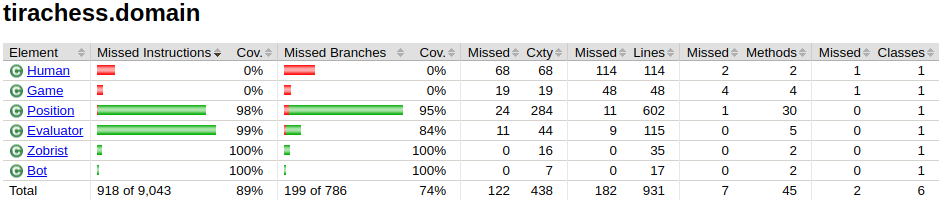

# Testing Document

The application has been tested mostly using unit tests. Especially the classes related to the chess AI and move generation have been tested extensively. However, the parts of code that take care of getting user input from the command-line and showing the game status are tested manually by using the application. Also the performance tests have not been tested by automated tests. 

## Unit testing

The move generation testing uses positions from https://www.chessprogramming.org/Perft_Results. I was able to catch quite many bugs in move generation through these pregenerated positions. The tests test at maximum of 4 depth for performance reasons but I have manually tested positions at higher depths as well to make sure move generation works as intended. 

Here is the current test coverage report for domain classes and data structures. (17th of March, 2021). 




## Performance testing

Performance tests can be run by the user by choosing option 3 when the program starts. 

For the data structures, the program runs ten tests and then takes average time for the 8 last tests. The tests use basic methods of arraylists/hashmaps.

For the algorithm comparison (alpha-beta vs minmax), I run the algorithms at depth 3 for different starting positions. 

### MyArrayList vs ArrayList

The custom created MyArrayList seems to perform similarly to the Java's ArrayList. Here are some test results. 

```
MyArrayList took 625.796142ms
Java ArrayList took 637.176248ms
```
```
MyArrayList took 571.568581ms
Java ArrayList took 469.167876ms
```
```
MyArrayList took 656.591087ms
Java ArrayList took 669.573394ms
```

### MyHashMap vs HashMap

```
MyHashMap took 2449.680591ms
Java HashMap took 2175.189017ms
```

```
MyHashMap took 2479.104841ms
Java HashMap took 2124.228269ms
```

```
MyHashMap took 2460.464192ms
Java HashMap took 2002.641798ms
```

### Alpha-beta Search vs Minmax Search

Alpha-beta search is clearly way faster than the minmax search. This is thanks to the pruning of the tree. 

Position 1 (rnbqkbnr/pppppppp/8/8/8/8/PPPPPPPP/RNBQKBNR w KQkq - 0 1)


```
Alpha-beta took 11.5975493ms
Minmax took 33.8919605ms
```

Position 2 (rnbqkbnr/pppppppp/8/8/8/8/PPPPPPPP/RNBQKBNR w KQkq - 0 1)


```
Alpha-beta took 28.0314432ms
Minmax took 113.0949169ms
```

Position 3 (r3k2r/p1ppqpb1/bn2pnp1/3PN3/1p2P3/2N2Q1p/PPPBBPPP/R3K2R w KQkq -)


```
Alpha-beta took 76.5165789ms
Minmax took 447.3095657ms
```